# Performance Refinement of Data

* Author(s): Philippe Hausler <phausler@apple.com>

## Introduction

In Swift 3 the Foundation team introduced a new structural type to represent `NSData` exposed into Swift.

`Data` allows developers to interact with binary data with value semantics, which is often more appropriate than using pointers like `UnsafeMutablePointer`. Having an encapsulating type to abstract the common operations is often quite advantageous to tasks like parsing, where types like `String` may not be appropriate for or have hidden performance "gotchas". 

`Data` can easily be a critical point of performance for many tasks. `Data` is an appropriate common currency of transacting a safe managed buffer of bytes that interoperates well with existing Cocoa APIs. This means that it should be tuned for performance as much as possible. 

## Motivation

There are several outstanding performance improvements which can be made to `Data`; issues regarding `Data`'s performance have been raised with the Foundation team both publicly and privately, and we would like to address those.

`Data` should be as fast as possible. Currently, most of the backing of `Data` is implemented in Foundation, while being quite fast for reallocations and other operations, this means that calls are made between Swift and Objective-C even for simple things like count for every access.

This Swift–Objective-C boundary means that no inlining can be performed across it; even when we have full control over the backing implementation and the caller, what would normally be just a single offset load instructions ends up becoming many just for the benefit of an objc_msgSend (not to mention ARC operations). Even though the calls are heavily optimized, they will never be as fast as a single instruction.

## Proposed solution

In order to make `Data` as fast as possible the implementation needs to be inlined; since that is one of the best performance optimizations that Swift can offer. To do this it requires a re-think of how `Data` and `NSData` interact. This means that the structure `Data` will need to adopt certain attributes that will allow it to be inlined into the call-sites. The function dispatch overhead will be reduced but also optimization passes like cold paths and branch elimination can be possibilities for the compiler to do the best possible thing for the call site.

`Data` will adopt the annotation `@inline(__always)` in key locations and use a non-Objective-C backing class to store the pointer and length (and other internal ivars). That backing object will allow for a reduction of capture points as well as avoid extra retain/releases that were added for mutation detection. 

Instead of using `_MutablePairBoxing` (which uses closures to map invocations to references or apply mutations with copy on write semantics) the new backing implementation can easily be applied with copy on write semantics without any `Unmanaged` "dancing". That "dancing" complicates code and it can be made considerably simpler. Furthermore, avoiding this "dance" can reduce the calls to retain and release down to zero in the application of mutations in unique referenced cases as well as mapping non mutating invocations to backing storage.

Subclassing the reference type `NSData` is still something that Foundation should support for the wrapping of the reference type in a structure. This effectively means there are five types of backing for `Data`: Swift-implemented, immutable NSData, mutable NSMutableData, custom subclasses of NSData, and custom subclasses of NSMutableData. These specific cases are delineated to offer the most efficient inline cases possible.

Since Foundation can enforce a no dynamic dispatch needed contract with itself in the cases of the standard class cluster members of NSData and NSMutableData Foundation can assure these cases are acceptable to not need dynamic dispatch for every time `bytes` or `length` are accessed and the values can be cached until the data is mutated or disposed of. In the cases where a subclass is used of course all bets are off and every point requires dynamically calling out.

In short this will mean that fetching the `count` of a `Data` can be optimized to a single branch and load from an offset and this same optimization can be applied to many other methods on `Data`.

## Bridging to and from Objective-C

Many of the sources that Data is derived from are sourced from the SDKs written in Objective-C. For many other types like `Array`,`Set`, `Dictionary`, or `String` the objects returned are not very large. Arrays may have a handful of objects, strings may only be a few hundred characters and so on. In these cases it makes sense to "eagerly" bridge those reference types into a more inline-able version (there are exclusions to this but in general it is most often the case). 

`Data` does not follow this rule. Often it is sourced from files on disk (which could be exceedingly large) or results from network transactions of downloads. These cases would definitely suffer from having an "eager" O(n) bridge; due to not only memory allocation duplications to hold both backing stores but also to the byte copy from the reference type to the value type. `Data` should be fast no matter where it came from unless it is truly unknown on it's dynamic dispatch requirements. 

To build a `Data` that is fast for inline optimizations the bytes pointer and length need to be cached for the duration of the object. When `as` is used to bridge a custom reference to `Data` dynamic dispatch must occur on every call to count and every time bytes are touched but if the `Data` is known to be obtained from a source that we can control the dynamic dispatch expectations that dynamic dispatch can be elided and behavior can be preserved by mimicking the Objective-C implementation in Swift. 

Bridging in the other direction also has some distinct performance optimizations that can be taken advantage of as well. 

When the lifespan of the callout to Objective-C is well known the cases of Swift constructed `Data` can easily pass a `NSData` with a no-copy of the backing buffer. It is the responsibility of the Objective-C APIs to appropriately either not directly retain past the scope of the call or copy in the cases of long lasting references. Any Objective-C method or function that takes a `NSData` and just retains or unsafely stores it past the function callout is likely incorrect and has bugs no matter the language it was invoked in. This case where the `Data` is created in Swift to bridge it only needs to allocate the wrapper `NSData` but no O(n) copy needs to occur (unless it is holding a reference as previously stated).

The final case of bridging is when a `Data` is obtained from Objective-C and then passed directly back to Objective-C. The compiler has potentials of optimizations in direct callout cases such as `returnsAData() as NSData` with "peephole" optimizations but these are only really enforceable in limited scope (sometimes just the same line of code). Since the backing store can hold a reference to the reference type the bridge method (when not mutated) in those cases can pass that back over to Objective-C. For mutated versions a copy of that mutated version can be passed along as well (taking advantage of any optimizations the dynamic dispatch affords for calls to `copy`).


## Detailed performance breakdown

Each graph below is a comparison between the Swift 3 `Data` and the new version of `Data` for each of the inline cases. The horizontal axis in each graph represent N and the vertical axis in each graph represents the sampled duration in nanoseconds. Each data set in the plots are an average over 100 (unless otherwise specified) per value of N. The attached graphs were generated from optimized builds on a Mac Pro (Late 2013) 3.5 GHz 6-Core Intel Xeon E5 with 16 GB 1866 MHz DDR3.

```swift
func createSampleData(ofLength N: Int) -> Data {
    var buffer = [UInt8](repeating: 0, count: N)
    return buffer.withUnsafeMutableBytes { (buffer: UnsafeMutableRawBufferPointer) -> Data in
        arc4random_buf(buffer.baseAddress!, N)
        return Data(bytes: buffer.baseAddress!, count: N)
    }
}

func createSampleDataReference(ofLength N: Int) -> NSData {
    var buffer = [UInt8](repeating: 0, count: N)
    return buffer.withUnsafeMutableBytes { (buffer: UnsafeMutableRawBufferPointer) -> NSData in
        arc4random_buf(buffer.baseAddress!, N)
        return NSData(bytes: buffer.baseAddress, length: N)
    }
}

func createSampleArray(ofLength N: Int) -> [UInt8] {
    var buffer = [UInt8](repeating: 0, count: N)
    buffer.withUnsafeMutableBytes { (buffer: UnsafeMutableRawBufferPointer) -> Void in
        arc4random_buf(buffer.baseAddress!, N)
    }
    return buffer
}

```

### Accessing count

This should be a O(1) operation. The y axis is measured in nanoseconds sampled over 100000 iterations.

```swift 
// setup
let data = createSampleData(ofLength: N)
// start measuring
_ = data.count
// end measuring
```

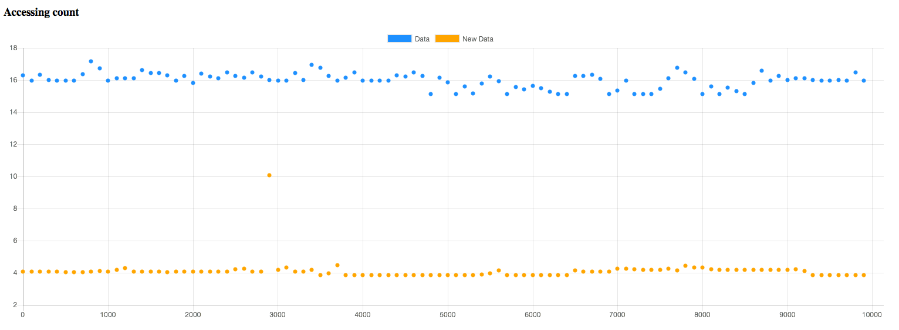

### Subscripting

This should be a O(1) operation. The y axis is measured in nanoseconds sampled over 100000 iterations.

```swift 
// setup
let data = createSampleData(ofLength: N)
// start measuring
_ = data[index]
// end measuring
```

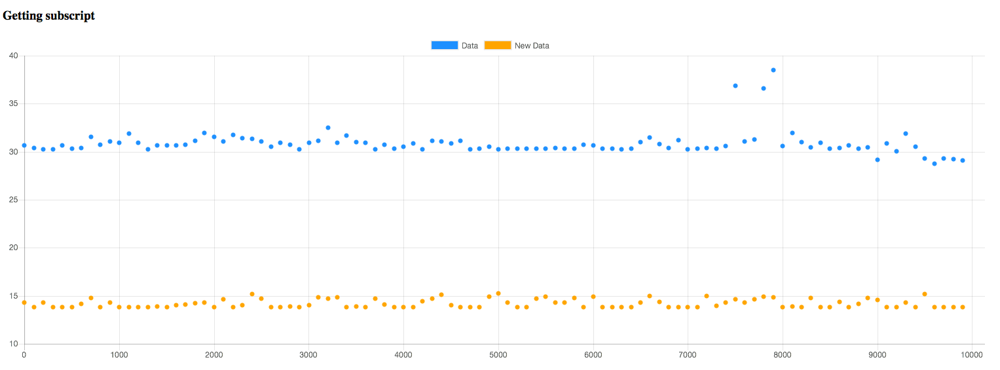

---

```swift 
// setup
var data = createSampleData(ofLength: N)
// start measuring
data[index] = 0x00
// end measuring
```

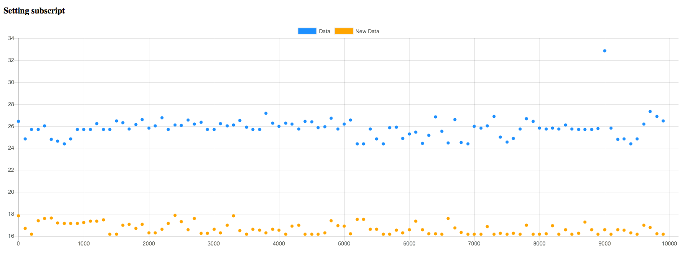

### Appending

This should be a O(N) operation

```swift
// setup
let dataToAppend = createSampleData(ofLength: N)
var data = Data()
// start measuring
data.append(dataToAppend)
// end measuring
```

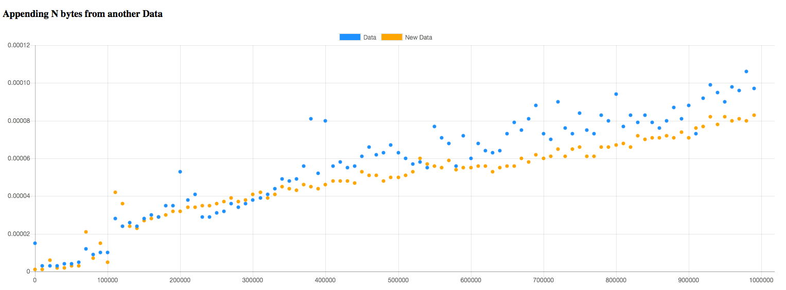

---

```swift
// setup
let arrayToAppend = createSampleArray(ofLength: N)
var data = Data()
// start measuring
data.append(contentsOf: arrayToAppend)
// end measuring
```

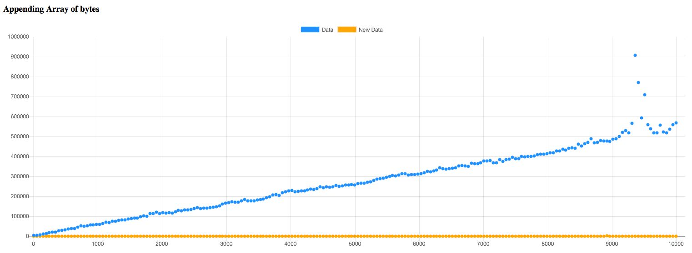

The new version is still O(N) just a much smaller constant multiplier.

---

```swift
var data = Data()
// start measuring
for _ in 0..<N {
    data.append(contentsOf: [0xFF, 0xFE, 0xFD, 0xFC, 0xFB, 0xFA])
}
//end measuring
```

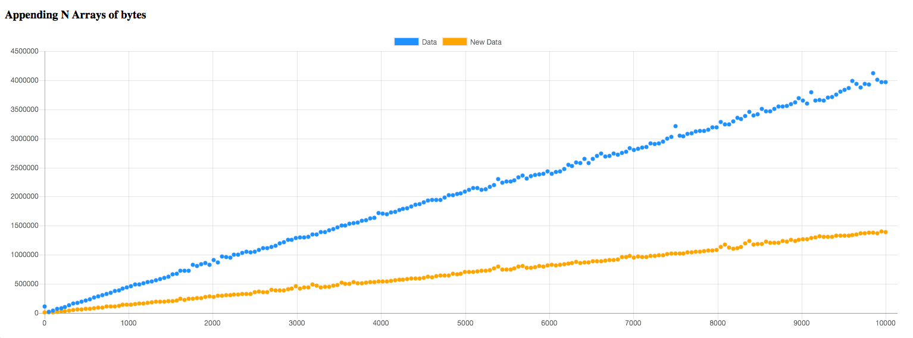

### Replacing sub ranges

```swift
// setup
var data = createSampleData(ofLength: N)
// start measuring
data.replaceSubrange(0..<N, with: replacement)
// end measuring
```

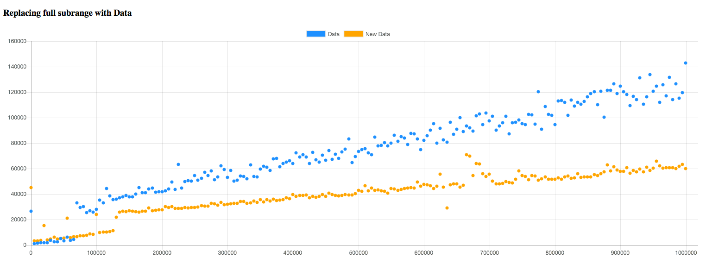

---

```swift
// setup
var data = createSampleData(ofLength: N)
// start measuring
data.replaceSubrange(0..<min(N, 5), with: replacement)
// end measuring
```

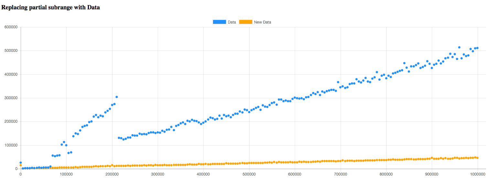

### Growth of count

```swift
// setup
var data = Data()
// start measuring
data.count = N
// end measuring
```

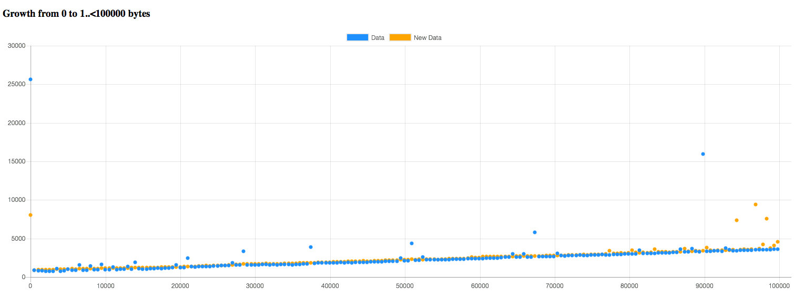

```swift
// setup
var data = Data()
// start measuring
data.count = N
// end measuring
```

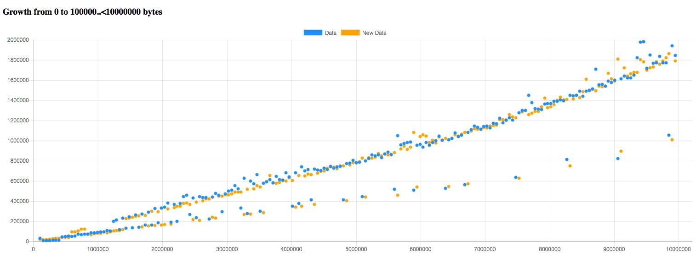

```swift
// setup
var data = Data()
data.count = starting
// start measuring
data.count = N
// end measuring
```

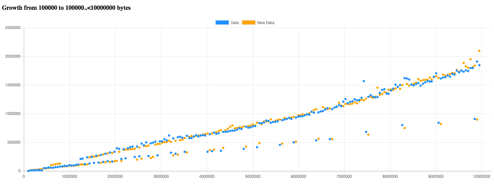


### Bridging to reference types

This should be a O(1) operation. In bridging to a reference case the previous implementation was a bit faster. The only real extra overhead here is an allocation of the NSData object since the Swift backed `Data` has no existing reference type to pass along. There are a few extra optimizations that can be done in this path to reduce it by the approximately 150 nanosecond difference. In practice the cases where `Data` is being bridged back out to Objective-C are usually cases like writing to a file or socket which dwarf that 150 nanosecond differential.

```swift 
// setup
let data = createSampleData(ofLength: N)
// start measuring
_ = data as NSData
// end measuring
```

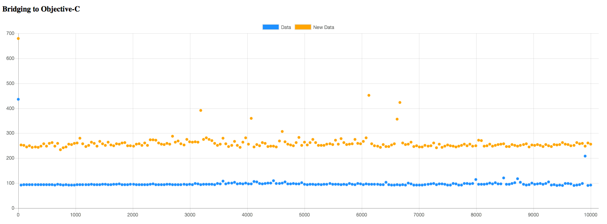

### Bridging from reference types

This should be a O(1) operation

```swift 
// setup
let data = createSampleDataReference(ofLength: N)
// start measuring
_ = data as Data
// end measuring
```

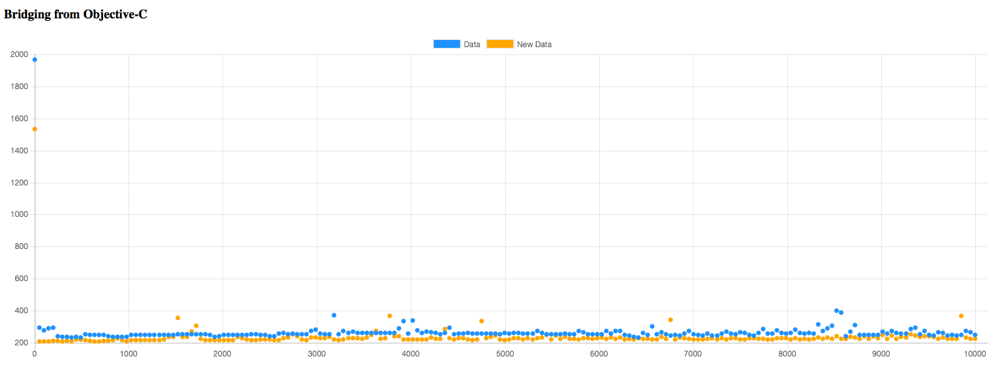

