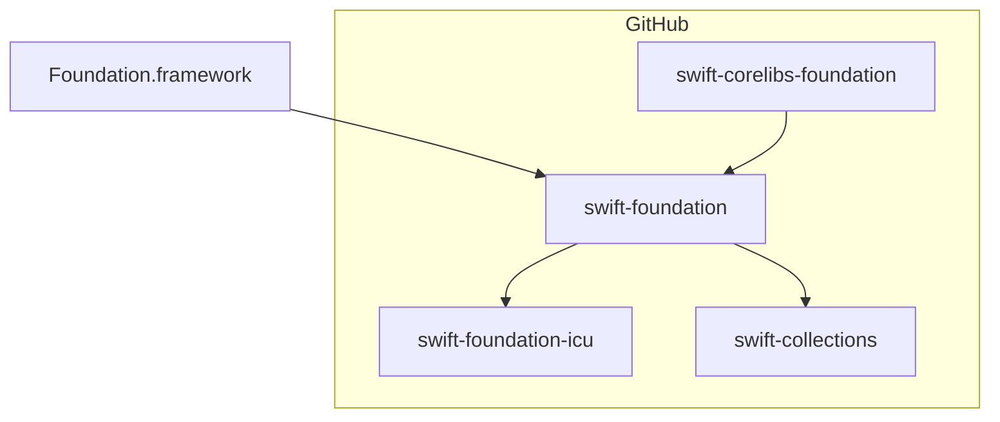

# Foundation

The Foundation framework defines a base layer of functionality that is required for almost all applications. It provides primitive classes and introduces several paradigms that define functionality not provided by either the Objective-C runtime and language or Swift standard library and language.

It is designed with these goals in mind:

* Provide a small set of basic utility classes and data structures.
* Make software development easier by introducing consistent conventions.
* Support internationalization and localization, to make software accessible to users around the world.
* Provide a level of OS independence, to enhance portability.

There is more information on the Foundation framework [here](https://developer.apple.com/library/mac/documentation/Cocoa/Reference/Foundation/ObjC_classic/).

This project, `swift-corelibs-foundation`, provides a compatibility implementation of the Foundation API for platforms where there is no Objective-C runtime. On macOS, iOS, and other Apple platforms, apps should use the Foundation that comes with the operating system.

## Project Navigator

Foundation builds in different configurations and is composed of several projects.



### Swift Foundation

A shared library shipped in the Swift toolchain, written in Swift. It provides the core implementation of many key types, including `URL`, `Data`, `JSONDecoder`, `Locale`, `Calendar`, and more in the `FoundationEssentials` and `FoundationInternationalization` modules. Its source code is shared across all platforms.

_swift-foundation_ depends on a limited set of packages, primarily [swift-collections](http://github.com/apple/swift-collections) and [swift-syntax](http://github.com/apple/swift-syntax).

### Swift Corelibs Foundation

A shared library shipped in the Swift toolchain. It provides compatibility API for clients that need pre-Swift API from Foundation. It is written in Swift and C. It provides, among other types, `NSObject`, class-based data structures, `NSFormatter`, and `NSKeyedArchiver`. It re-exports the `FoundationEssentials` and `FoundationInternationalization` modules, allowing compatibility for source written before the introduction of the _swift-foundation_ project. As these implementations are distinct from those written in Objective-C, the compatibility is best-effort only.

_swift-corelibs-foundation_ builds for non-Darwin platforms only. It installs the `Foundation` umbrella module, `FoundationXML`, and `FoundationNetworking`.

### Foundation ICU

A private library for Foundation, wrapping ICU. Using a standard version of ICU provides stability in the behavior of our internationalization API, and consistency with the latest releases on Darwin platforms. It is imported from the `FoundationInternationalization` module only. Clients that do not need API that relies upon the data provided by ICU can import `FoundationEssentials` instead.

### Foundation Framework

A [framework](https://developer.apple.com/library/archive/documentation/MacOSX/Conceptual/BPFrameworks/Frameworks.html) built into macOS, iOS, and all other Darwin platforms. It is written in a combination of C, Objective-C, and Swift. The Foundation framework compiles the sources from _swift-foundation_ into its binary and provides one `Foundation` module that contains all features.


## Using Foundation

Here is a simple `main.swift` file which uses Foundation. This guide assumes you have already installed a version of the latest [Swift binary distribution](https://swift.org/download/#latest-development-snapshots).

```swift
import Foundation

// Make a URLComponents instance
let swifty = URLComponents(string: "https://swift.org")!

// Print something useful about the URL
print("\(swifty.host!)")

// Output: "swift.org"
```

You will want to use the [Swift Package Manager](https://swift.org/package-manager/) to build your Swift apps.

## Working on Foundation

swift-corelibs-foundation builds as a standalone project using Swift Package Manager. Simply use `swift build` in the root of the checkout to build the project.

swift-corelibs-foundation also builds as part of the toolchain for non-Darwin platforms. Instructions on building the toolchain are available in the [Swift project](https://github.com/swiftlang/swift?tab=readme-ov-file#building).

### Building swift-corelibs-foundation on Windows

When building Foundation as a standalone project, it requires you to provide some dependencies that it will link during the build. SwiftPM already fetches most of these dependencies and on Linux the remaining dependencies (dispatch, zlib, curl, libxml) are found in the Swift toolchain or on the host OS. However, Windows does not ship with zlib/curl/libxml on the host OS. In order to build swift-corelibs-foundation as a package on Windows, you must first checkout and build these dependenies before running `swift build` as recommended above. To do this, you can build the provided CMake target which (instead of building Foundation via CMake) will checkout and build these 3 dependencies via CMake and provide environment variables that will connect the SwiftPM build to these dependencies. To build these targets, run the following commands:

```
cmake -G Ninja -B <build folder> -DFOUNDATION_SWIFTPM_DEPS=YES
cmake --build <build folder> --target --target WindowsSwiftPMDependencies
```

After running these commands, the output will include a list of environment variables to set. After setting these environment variables, you can run `swift test`/`swift build` just like on Linux in order to build swift-corelibs-foundation with an existing Swift toolchain.

## Contributions

We welcome contributions to Foundation! Please see the [known issues](Docs/Issues.md) page if you are looking for an area where we need help. We are also standing by on the [mailing lists](https://swift.org/community/#communication) to answer questions about what is most important to do and what we will accept into the project.

